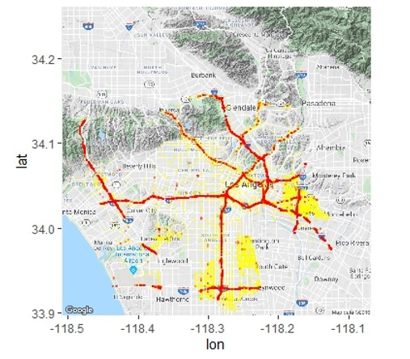
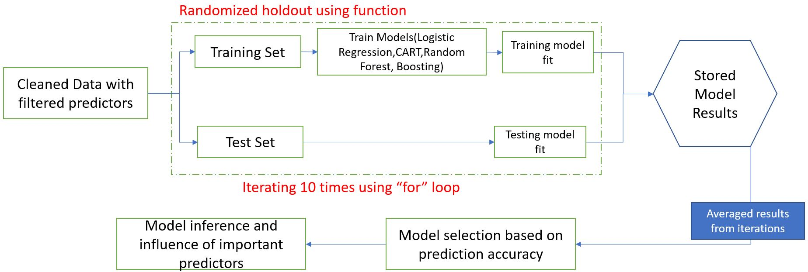
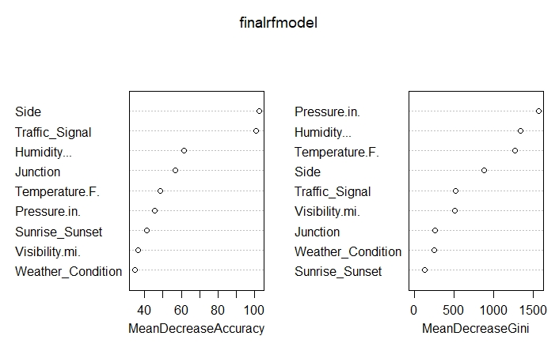

# Accident-Severity-Prediction-LA

Authors:  **Aravindh Siddharth Prabaharan**
Credits: [Sobhan Moosavi](https://smoosavi.org/)

---

## Intro
Scrubbed and cleansed 2.3 million data to predict the level of severity for road accidents in Los Angeles, using machine learning models to setup amenities nearby.

---

## Sources
- The data source is from [US_Accidents](https://osu.app.box.com/v/us-accidents-dec19)
- The link to use [Gmap](https://cloud.google.com/maps-platform/)
---

## Explanation of the Code

The code, `accident_LA.R`, begins by importing necessary R libraries:
```
library(rpart)
library(gbm)
library(ada)
library(randomForest)
library(caret)
library(car)
library(ggmap)
library(ggplot2)
```
- *NOTE : The data may change over time and the results may not be same everytime.*

### Data Visualization:
```
#------------------------Visualizing using Gmaps-------------------------------

library(ggmap)
ggmap::register_google(key = "YOUR KEY")
#taking Los angeles map from googlemaps and plotting all datapoints in the map
p <- ggmap(get_googlemap(maptype="terrain",zoom=11,center = c(lon = -118.28904, lat = 34.078926)))
p + geom_point(aes(x =Start_Lng , y =Start_Lat ),colour = 'red', incidents, alpha=0.25, size = 0.5)

i2lsev <-subset(incidents,incidents$Severity=='1') #subsetting only low severity
i2hsev<-subset(incidents,incidents$Severity=='2')  #subsetting only high severity
  
Finally, we visualize the data.  We save our plot as a `.jpeg` image:
```


#### Model Framework


#### Best Model Result

```
#randomforest
library(randomForest)
set.seed(80)
rfmodel <-  randomForest(Severity ~ ., train.data, importance = T )
plot(rfmodel)
```



---

## How to Run the Code using R Studio
*1. Click on File->Open*

*2. Choose directory where `accident_LA.R` is stored*

*3. Click on run or Ctrl+Enter*

*4. The Results are displayed in Global Environment(right) and the plots are shown (bottom right) in R studio*

---

## Suggestions and Future scope
Efficient urban planning and better transportation infrastructure like broadening of roads can reduce accidents. This project focuses on the dataset of a city, but in future we can imply this methodology to predict the accident severity of a state or entire country. We can also predict number of accidents on a given freeway and the duration of accidents. 

